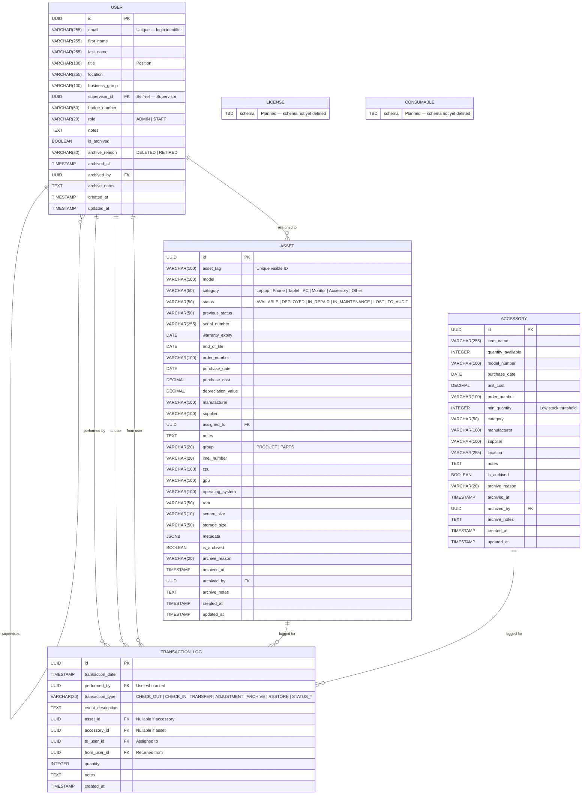

# Pandora — Entity Relationship Diagram

Source of truth: `backend/api/models.py`. This document is the human-readable companion to `erd.html`; both render the same Mermaid diagram below.

## Diagram

## Entities

### USER
The single principal table — covers both Pandora operators (admins/staff who log in) and the people that assets get assigned to. There is no separate `Person` table.

- **Login identity:** `email` is unique and is the `USERNAME_FIELD`; password is stored on the underlying `AbstractUser`.
- **Role:** `ADMIN` (full access) or `STAFF`.
- **Self-reference:** `supervisor_id` points to another `User` (`SET_NULL` on delete).
- **Archivable:** inherits `is_archived`, `archive_reason`, `archived_at`, `archived_by`, `archive_notes` from `ArchivableMixin`.

### ASSET
A trackable, individually-identified piece of hardware (laptop, phone, monitor, etc.).

- **Display identifier:** `asset_tag` (unique). There is intentionally no `asset_name` or `location` field.
- **Lifecycle status:** `status` drives availability semantics; `previous_status` lets the system restore prior state after temporary transitions (e.g. returning from `IN_REPAIR`).
- **Holder:** `assigned_to` is a nullable FK to `User` (`SET_NULL`). Render names via the serializer's nested `assigned_to_detail`.
- **Spec fields:** `cpu`, `gpu`, `ram`, `storage_size`, `operating_system`, `screen_size`, `imei_number` — most are blankable since they only apply to subsets of categories.
- **`metadata` (JSONB):** open-ended bag for category-specific extensions without schema migrations.
- **Archivable.**

### ACCESSORY
A bulk, fungible item tracked by quantity rather than per-unit (cables, adapters, mice, keyboards).

- **Quantity-driven:** `quantity_available` is the source of truth; check-in/check-out actions adjust it. `min_quantity` is the low-stock threshold.
- **No `assigned_to`:** assignment is captured only in `TRANSACTION_LOG` (an accessory can be checked out to many people in parallel).
- **Archivable.**

### TRANSACTION_LOG
Append-only audit trail for every state change in the system.

- **Polymorphic target:** each row references at minimum one of `asset`, `accessory`, `to_user`, or `from_user` (enforced by `txlog_has_target` `CheckConstraint`). User-only events (e.g. archive/restore a person) carry just `to_user`.
- **`performed_by`** is `PROTECT` — you cannot delete a user who has acted on the system; archive them instead.
- **`transaction_type`** covers check-in/out, transfer, adjustment, archive/restore, and `STATUS_*` lifecycle changes — see the enum in `models.py`.
- **Read-only API:** exposed via `TransactionLogViewSet` (no create/update/delete endpoints).

### LICENSE *(planned)*
Reserved entity for software licenses (seats, expiry, vendor, etc.). Schema not yet defined; the Inventory tab renders `ComingSoonPanel`.

### CONSUMABLE *(planned)*
Reserved entity for low-value disposables (printer toner, batteries, etc.). Schema not yet defined; the Inventory tab renders `ComingSoonPanel`.

## Relationships

| From | To | Kind | Meaning |
|---|---|---|---|
| `User` | `User` | 1 — many | `supervisor_id` self-reference |
| `User` | `Asset` | 1 — many | `assigned_to` (current holder) |
| `User` | `TransactionLog` | 1 — many | `performed_by` (actor) |
| `User` | `TransactionLog` | 1 — many | `to_user` (assignee in this event) |
| `User` | `TransactionLog` | 1 — many | `from_user` (returner in this event) |
| `Asset` | `TransactionLog` | 1 — many | logged events for the asset |
| `Accessory` | `TransactionLog` | 1 — many | logged events for the accessory |
| `User` | `User` / `Asset` / `Accessory` | 1 — many | `archived_by` (actor on archive) — omitted from the diagram for clarity |

## Conventions

- Every primary key is a UUID generated by `uuid.uuid4` — never assume integer IDs on the client.
- `Asset.status`, `Asset.category`, `Asset.group`, `User.role`, `TransactionLog.transaction_type` are all `TextChoices` enums; the **enum value** (e.g. `'AVAILABLE'`) is what the API returns. Use the corresponding `*_LABELS` map in `frontend/src/types/` for display.
- `created_at` / `updated_at` on `User`, `Asset`, `Accessory` come from `TimeStampedModel`; `TransactionLog` has only `created_at` plus `transaction_date`.
- Archivable entities (`User`, `Asset`, `Accessory`) are soft-deleted; queries default to `is_archived=False` unless `?include_archived=1` is passed.
