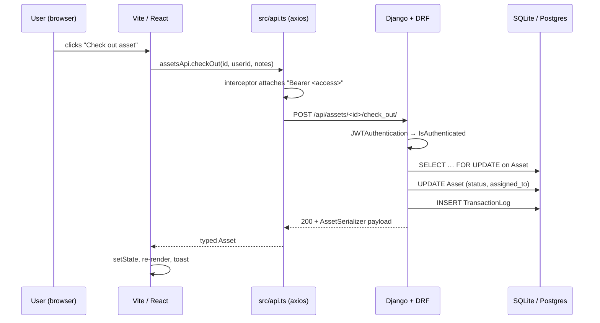
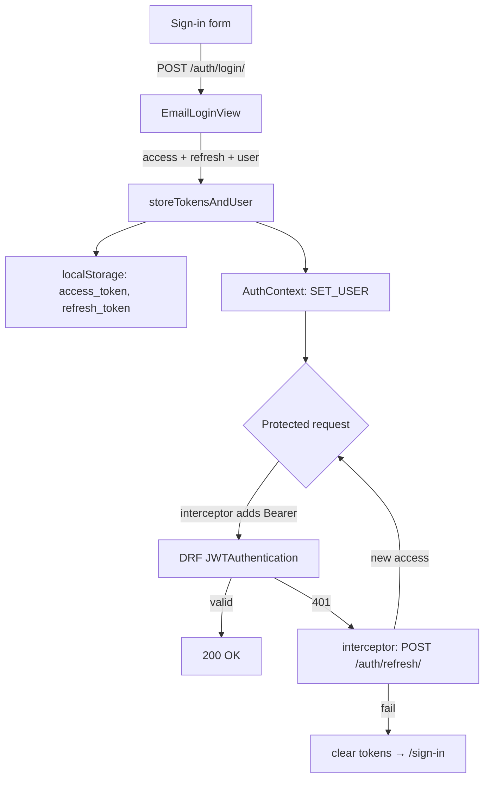

# 03 · Architecture

## Request flow, end-to-end



Every protected request goes through this same shape. There's no middleware, no proxy, no message bus. Direct.

## Folder map

```
Pandora/
├── frontend/
│   └── src/
│       ├── api.ts                # SOLE HTTP entry point — axios instance + per-resource wrappers
│       ├── theme.ts              # Design tokens (colors, spacing, typography, shadows, …)
│       ├── App.tsx               # BrowserRouter, route table, Provider stack
│       ├── pages/                # One file per route (Home, Inventory, Activity, People, …)
│       ├── components/           # Reusable UI: Sidebar, Header, modals, table cells
│       ├── context/              # Context + useReducer state (Auth, Toast, Recency, Notifications)
│       ├── hooks/                # Custom hooks (use<Name>.ts)
│       ├── types/                # Shared TS interfaces by domain
│       ├── utils/                # Pure helpers
│       └── index.css             # Font wiring + global resets only
│
├── backend/
│   ├── core/                     # Django project config — settings, urls, wsgi, pagination
│   │                             # NEVER add models or business logic here
│   └── api/                      # Single Django app — all domain code lives here
│       ├── models.py             # User, Asset, Accessory, TransactionLog
│       ├── serializers.py        # DRF serializers with *_detail nested reads
│       ├── views.py              # ViewSets with @action methods (check_in, check_out, …)
│       ├── auth.py               # Email login, register, Google OAuth, /me
│       ├── urls.py               # DRF router + auth sub-routes
│       ├── admin.py              # Django admin registrations
│       └── migrations/           # Auto-generated; never edit by hand
│
├── erd.html                      # Source of truth for entity relationships (Mermaid ERD)
└── CLAUDE.md                     # Live operational doc
```

The split is intentional: `core/` is Django plumbing, `api/` is Embedded Silicon's domain. If you find yourself opening anything inside `core/` other than `settings.py`, stop and ask why.

## The three-layer visual system

The interface is built from three stacked surfaces. Every screen slots into one of them. Adding a fourth (a card inside a card, a modal inside a modal) is the most common way to break the design.

| Layer | Surface | Where it lives |
|---|---|---|
| 1. Background | `bg-auth.jpg` (dark photographic) | `<body>` background, always present |
| 2. Glass sidebar | `rgba(46, 124, 253, 0.88)` + `backdrop-filter: blur(4px)` | [`Sidebar.tsx:36`](../frontend/src/components/Sidebar.tsx#L36) |
| 3. White content panels | `colors.bgSurface` (`#ffffff`) | every page body, every modal |

Rules:

- Don't introduce a fourth nested surface. If a panel needs visual separation from another panel on the same layer, use border or `bgStripe`, not another card.
- Orange (`#fc9c2d`) is for genuine urgency only — overdue, archive badge, retire CTA. Don't use it for decoration.
- Cyan (`#2dfcf9`) is reserved for badges; it looks garish on white surfaces.

The full token set is documented in [05-frontend-conventions.md § Tokens](05-frontend-conventions.md#tokens-from-themets) and lives in [`theme.ts`](../frontend/src/theme.ts).

## JWT auth flow



Walk through it once with the source open:

| Step | File / line |
|---|---|
| Login form submits | [`pages/SignIn.tsx`](../frontend/src/pages/SignIn.tsx) |
| `login()` calls `authApi.login` | [`AuthContext.tsx:78-81`](../frontend/src/context/AuthContext.tsx#L78-L81) |
| Backend validates and returns `{access, refresh, user}` | [`api/auth.py:36-49`](../backend/api/auth.py#L36-L49) |
| Tokens stored in `localStorage`, user dispatched into Context | [`AuthContext.tsx:72-76`](../frontend/src/context/AuthContext.tsx#L72-L76) |
| Every subsequent request attaches `Authorization: Bearer <access>` | [`api.ts:14-20`](../frontend/src/api.ts#L14-L20) |
| On `401`, axios interceptor calls `/auth/refresh/` once and retries | [`api.ts:22-43`](../frontend/src/api.ts#L22-L43) |
| If refresh fails, tokens are cleared and the page navigates to `/sign-in` | [`api.ts:35-39`](../frontend/src/api.ts#L35-L39) |
| On page reload, `AuthContext` rehydrates by calling `/auth/me/` if a token exists | [`AuthContext.tsx:58-70`](../frontend/src/context/AuthContext.tsx#L58-L70) |
| `ProtectedRoute` blocks render until `loading` is false | [`ProtectedRoute.tsx`](../frontend/src/components/ProtectedRoute.tsx) |

Token lifetimes (configurable in [`settings.py:181-185`](../backend/core/settings.py#L181-L185)):

- access: 1 hour
- refresh: 7 days, with `ROTATE_REFRESH_TOKENS = True` (every refresh swaps both)

## State management

No Redux, no Zustand, no Recoil. Global state is plain React Context with `useReducer`. There are four providers, all stacked at the root in [`App.tsx:18-37`](../frontend/src/App.tsx#L18-L37):

| Provider | What it owns | File |
|---|---|---|
| `AuthProvider` | current user, `isAuthenticated`, `loading`, login/logout | [`context/AuthContext.tsx`](../frontend/src/context/AuthContext.tsx) |
| `NotificationsProvider` | bell-icon notifications | `context/NotificationsContext.tsx` |
| `RecencyProvider` | "new since last visit" badge counts on Inventory / People / Activity | `context/RecencyContext.tsx` |
| `ToastProvider` | global toast queue | `context/ToastContext.tsx` |

If you need new global state, follow the AuthContext shape: `interface State`, `type Action`, `function reducer`, `Provider`, `useX()` hook with a non-null assertion. See [05-frontend-conventions.md](05-frontend-conventions.md#contextusereducer-pattern).

## Pagination

DRF pagination is on with `PAGE_SIZE: 500` ([`settings.py:167-168`](../backend/core/settings.py#L167-L168)) — large because the page itself is small. The frontend handles both shapes (paginated `{count, next, previous, results}` and raw arrays) via the `unwrapList` helper in [`api.ts:46-49`](../frontend/src/api.ts#L46-L49). Don't roll your own.

## Throttling

20 requests/minute for anonymous users, 240/minute for authenticated. Defined in [`settings.py:169-176`](../backend/core/settings.py#L169-L176). If you see `429` during local testing, slow down or temporarily comment the throttle classes — don't increase the prod limit without a real reason.
